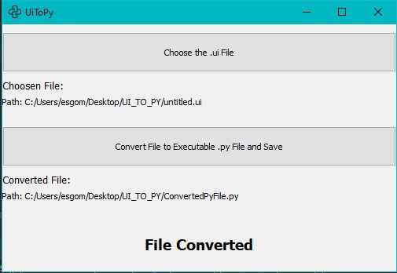
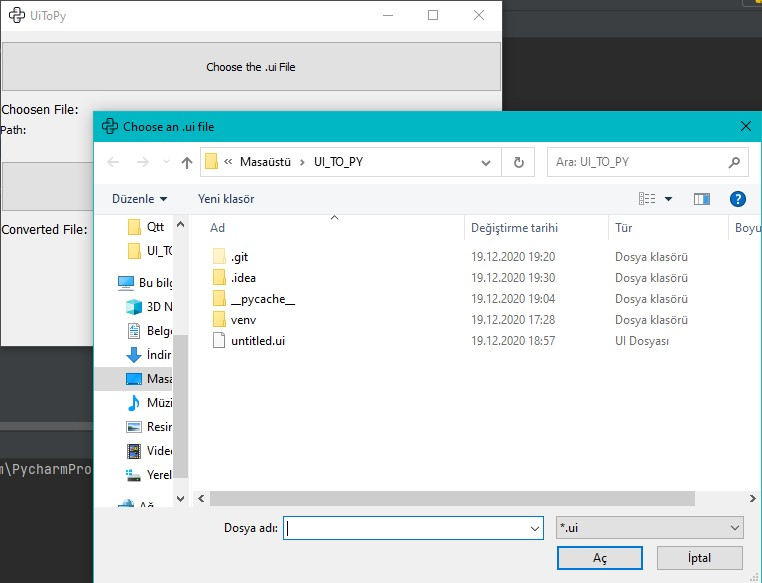
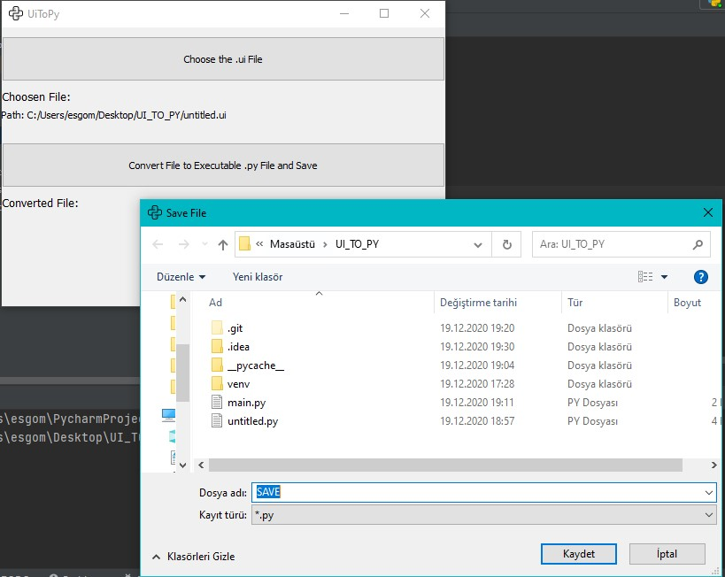

# UiToPy

Basically convert .ui QtDesigner file to .py file,like untitled.py in this project.
You can also run this file in another python file.I use it in main.py. 
You must have installed PyQt5.

